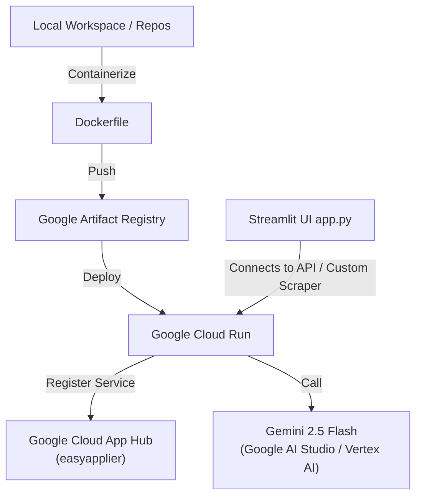
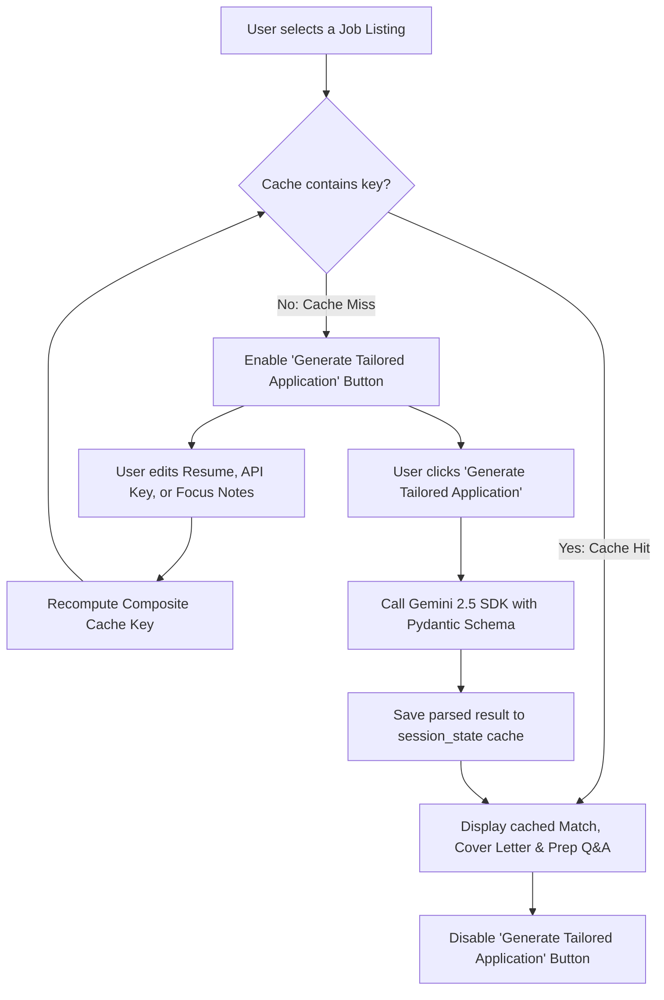

# EasyApplier: AI-Powered Job Optimization Agent & Dashboard

EasyApplier is a production-ready career operations system featuring a FastAPI backend and a Streamlit frontend. It scrapes live job listings from LinkedIn, evaluates candidate compatibility using Gemini structured outputs (enforcing strict Pydantic schemas), and delivers customized cover letters, resume updates, and interview prep guides.

This project integrates the official **Google GenAI SDK** for structured schema validation and is built to run locally, package as a container, deploy to **Google Cloud Run**, and register under **Google Cloud App Hub** for logical environment tracking.

---

## 🛠️ Architecture & System Integration

EasyApplier uses a dual-interface architecture:
1. **API Backend ([main.py](file:///C:/Users/pinar/source/repos/easyapplier/main.py))**: Handles programmatic job retrieval, health probes, environment metadata, and raw LLM-matching operations.
2. **Interactive UI ([app.py](file:///C:/Users/pinar/source/repos/easyapplier/app.py))**: A responsive dashboard containing live job metrics, market insight visualizations, a candidate profile sidebar, and a tailored resume generator.



### 1. Google Cloud App Hub Registration
**App Hub** organizes deployed infrastructure into logical applications. Once EasyApplier is deployed to Google Cloud Run, its URL and service boundary are registered as a **Service** and **Workload** under your App Hub Application (`easyapplier` in region `us-east1`, project `ringed-land-397222`).

### 2. Structured Agent Outputs (Gemini 2.5)
Using the official `google-genai` SDK, this agent leverages schema-enforced JSON generation. When analyzing resumes against job descriptions, it forces Gemini to respond strictly matching the `ApplicationStrategy` schema, ensuring absolute reliability and zero output-parsing errors.

---

## ⚡ State & Cache Lifecycle

To optimize response times and prevent redundant billing (API token consumption), EasyApplier features an advanced **state-aware composite caching layer** in the Streamlit frontend. 

*   **Composite Cache Key**: Evaluations are locked behind a composite key consisting of `(job_link, api_key, resume_input, notes_input)`.
*   **Dynamic Button-Disabling**: Once a matching strategy is generated and saved, the "Generate Tailored Application" button is automatically grayed out and disabled.
*   **Automatic Cache Invalidation**: Modifying any parameters in the sidebar (resume text, focus notes, or API key) or changing the active job listing automatically triggers a cache miss, re-enabling the button for fresh evaluation.



---

## 📁 Project Structure

*   [app.py](file:///C:/Users/pinar/source/repos/easyapplier/app.py) — Interactive Streamlit dashboard with a theme-aware custom styling layer (light/dark mode), KPI cards, and market visualization charts.
*   [main.py](file:///C:/Users/pinar/source/repos/easyapplier/main.py) — Core FastAPI application serving API routes, HTML rendering, and agent matching endpoints.
*   [index.html](file:///C:/Users/pinar/source/repos/easyapplier/index.html) — Elegant, modern glassmorphic web interface served directly by the FastAPI backend.
*   [job_scraper.py](file:///C:/Users/pinar/source/repos/easyapplier/job_scraper.py) — Scraper utility extracting active job postings from public LinkedIn guest search pages.
*   [requirements.txt](file:///C:/Users/pinar/source/repos/easyapplier/requirements.txt) — Dependency declarations (FastAPI, Streamlit, Google GenAI, BeautifulSoup4, Pandas, Plotly).
*   [Dockerfile](file:///C:/Users/pinar/source/repos/easyapplier/Dockerfile) — Slim Python containerization configurations.
*   [.env.example](file:///C:/Users/pinar/source/repos/easyapplier/.env.example) — Configuration template for API keys and project settings.
*   [.gitignore](file:///C:/Users/pinar/source/repos/easyapplier/.gitignore) — Prevents committing credentials or environment folders.

---

## 🚀 Local Quickstart

### 1. Initialize and Activate Virtual Environment
Open PowerShell in this directory:
```powershell
# Create virtual environment
python -m venv venv

# Activate virtual environment
.\venv\Scripts\Activate.ps1

# Install dependencies
pip install -r requirements.txt
```

### 2. Configure Environment Variables
Copy `.env.example` to `.env` and fill in your Gemini API Key:
```powershell
copy .env.example .env
```
Open `.env` in your text editor and set:
*   `GEMINI_API_KEY=AIzaSy...` (your key from Google AI Studio)

### 3. Run the Backend API (FastAPI)
Start the FastAPI server:
```powershell
python main.py
```
Your backend will start at `http://localhost:8080`.
*   Interactive Landing Page: `http://localhost:8080`
*   Swagger API Docs: `http://localhost:8080/docs`

### 4. Run the Frontend Dashboard (Streamlit)
In a separate terminal (with virtual environment activated), run:
```powershell
streamlit run app.py
```
Your dashboard will start at `http://localhost:8501`. 
*   Toggle between Light and Dark mode using the button in the top right.
*   Check the sidebar to adjust your profile text and credentials.

---

## 🔌 API Documentation

### Liveness & Health check
*   **Method:** `GET`
*   **Path:** `/health`
*   **Response:**
    ```json
    {
      "status": "healthy",
      "service": "easyapplier-agent",
      "model_configured": "gemini-2.5-flash"
    }
    ```

### Retrieve Scraped Jobs
*   **Method:** `GET`
*   **Path:** `/api/jobs`
*   **Query Parameters:** `title` (e.g. `Python Developer`), `limit` (default: 35)
*   **Response:** List of LinkedIn guest postings.

### Analyze Application (Agent Optimization)
*   **Method:** `POST`
*   **Path:** `/api/apply`
*   **Request Payload (`application/json`):**
    ```json
    {
      "job_title": "AI Research Intern",
      "job_description": "We are looking for an AI Research Intern with experience in agentic workflows, LLMs, and Python. Experience with Google Cloud Platform is a plus.",
      "resume_text": "Kevin Pinard - MS in AI Student. Proficient in Python. Set up Google Antigravity IDE and developed local test scripts. Experience with Gemini API.",
      "user_notes": "Highlight my familiarity with Google's Antigravity CLI and App Hub."
    }
    ```
*   **Response Payload (`application/json`):**
    ```json
    {
      "match_score": 92,
      "fit_summary": "Kevin is an MS in AI student with hands-on experience in Google's agentic tools. His experience aligns perfectly with the requirements...",
      "cover_letter": "Dear Hiring Manager,\n\nI am writing to express my interest...",
      "resume_suggestions": [
        "Quantify your experience with Antigravity (e.g., 'Built and tested LLM-orchestrated agent workflows').",
        "Add a technical skills section highlighting Cloud Run, App Hub, and GenAI SDKs."
      ],
      "interview_prep": [
        "Question: Can you explain a multi-step agentic workflow you designed? Talking points: Discuss configuring Antigravity CLI and deploying custom FastAPI services."
      ]
    }
    ```

---

## ☁️ Google Cloud Deployment

To deploy this application to Google Cloud Run and register it in App Hub:

### 1. Build and Publish the Docker Container
Run this in PowerShell to build the container locally and upload it to Google Artifact Registry:
```powershell
# Authenticate with Google Cloud
gcloud auth login

# Configure Docker for Artifact Registry
gcloud auth configure-docker us-east1-docker.pkg.dev

# Create a repository in Artifact Registry (if it doesn't exist)
gcloud artifacts repositories create easyapplier-repo `
    --repository-format=docker `
    --location=us-east1 `
    --description="Docker repository for easyapplier"

# Build and Tag the Container
docker build -t us-east1-docker.pkg.dev/ringed-land-397222/easyapplier-repo/easyapplier-agent:latest .

# Push the Container to Google Cloud
docker push us-east1-docker.pkg.dev/ringed-land-397222/easyapplier-repo/easyapplier-agent:latest
```

### 2. Deploy to Cloud Run
Deploy the container as a managed server, injecting your API Key as an environment variable:
```powershell
gcloud run deploy easyapplier-service `
    --image=us-east1-docker.pkg.dev/ringed-land-397222/easyapplier-repo/easyapplier-agent:latest `
    --platform=managed `
    --region=us-east1 `
    --allow-unauthenticated `
    --set-env-vars="GEMINI_API_KEY=your_gemini_api_key_here,GCP_PROJECT_ID=ringed-land-397222,APPHUB_APPLICATION=easyapplier"
```
*(Copy the Service URL outputted after a successful deployment, e.g., `https://easyapplier-service-xxxx-ue.a.run.app`)*

### 3. Register in App Hub
Once the Cloud Run service is active:
1. Navigate to [Google Cloud App Hub Applications](https://console.cloud.google.com/apphub/applications).
2. Click on your `easyapplier` application.
3. Register a new **Workload** and **Service** by selecting your newly deployed `easyapplier-service` from the dropdown list.
4. Save the configuration to complete the link.

---

## 📄 Portfolio & Submission Highlights

When presenting this project for the Kaggle Capstone or on your resume, highlight these engineering decisions:

*   **Pydantic Constraint Enforcement**: Enforced structured output schemas in downstream processes, converting stochastic LLM evaluations into 100% predictable JSON structures.
*   **Composite Key Caching Layer**: Programmed custom state locks to minimize API tokens usage and control client response latency.
*   **Infrastructure-as-a-Service boundary**: Packaged and deployed using Docker container registries and Google Cloud Run managed services.
*   **App Hub Governance**: Integrated with Google Cloud App Hub to establish formal environment registries (Workloads/Services) for production tracking.
