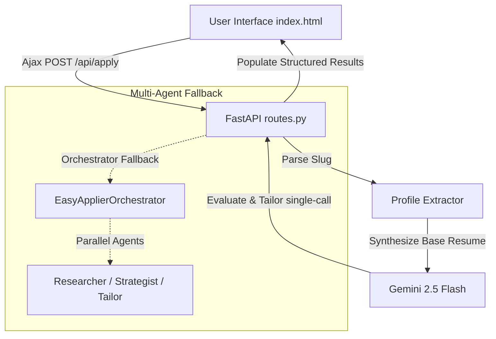

# EasyApplier: High-Performance AI-Powered Career Operations System

EasyApplier is a production-grade, highly automated career operations and Applicant Tracking System (ATS) optimization engine. It features a unified, fast **FastAPI backend** that serves a beautiful, responsive, modern glassmorphic frontend from its root endpoint.

It leverages a dynamic, multi-agent pipeline powered by the official **Google GenAI SDK (Gemini 2.5 Flash)** to scrape live LinkedIn job listings, synthesize customized candidate base resumes from any public LinkedIn profile URL, calculate industrial-grade ATS match metrics, and compile bespoke tailored resumes instantly.

The entire project is minimal, modular, lightning-fast, and production-ready. It contains **no heavy UI dependencies**, dropping browser page interaction and rendering latency to near-zero.

---

## ✨ Core Features & Capabilities

### 1. Adaptive, Dynamic Candidate Profiles & Base Resumes
EasyApplier supports **any valid LinkedIn URL** or custom user slug input in Step 2 of the UI (e.g., `https://www.linkedin.com/in/jane-smith-data-analyst` or `https://www.linkedin.com/in/clara-barton-registered-nurse`).
*   **Slug Parsing & Clean Name Extraction**: Automatically parses username slugs, stripping professional keywords (like *software, developer, analyst, nurse, manager, designer*) to isolate clean, capitalized full names.
*   **Keyword-Inferred Contexts**: Maps keywords in the profile slug to professional domains (Data Analytics, UI/UX Design, Product Management, Clinical Nursing, Finance, Digital Marketing, or general Software Engineering), establishing target headlines, key skills, and locations.
*   **Gemini Resume Synthesis**: Rather than using static placeholders or UCF-hardcoded templates, Gemini dynamically writes a comprehensive, highly realistic, and customized **base resume** for that candidate on-the-fly, creating bespoke career history, credentials, and achievements.

### 2. Multi-Dimensional ATS Matching Engine
EasyApplier evaluates candidate fit against the job description using a rigorous, multi-dimensional assessment that mimics industrial candidate-screening criteria across 4 weighted categories:
$$\text{Overall Match Score} = (0.40 \times \text{Hard Skills}) + (0.30 \times \text{Experience}) + (0.15 \times \text{Education}) + (0.15 \times \text{Soft/Domain})$$

*   **Hard Skills Match (40% Weight)**: Evaluation of technical software, tools, and hard qualification alignments.
*   **Experience Alignment (30% Weight)**: Job title, past achievements, and seniority-level matching.
*   **Education Fit (15% Weight)**: Academic level, major/field, and credential compatibility.
*   **Soft Skills & Domain Fit (15% Weight)**: Communication, teamwork, and domain alignment (e.g., Healthcare, SaaS, Finance, AI).

### 3. Interactive Glassmorphic Match Dashboard
The frontend contains a stunning, ultra-modern dashboard that visualizes candidate fit:
*   **Conic-Gradient Radial Progress Rings**: Animated color-shifting matching indicators (Emerald for $\ge 80\%$, Cyan for $60\% - 79\%$, Amber/Orange for $< 60\%$).
*   **Score Progress Cards**: Clean, modern cards displaying individual category breakdowns:
    *   🔵 **Cyan Progress**: Hard Skills & Keyword Match
    *   🟢 **Emerald Progress**: Experience & Title Relevance
    *   🟣 **Indigo Progress**: Education & Academic Fit
    *   🟡 **Violet Progress**: Soft Skills & Sector Compatibility
*   **Bulleted Actionable Feedback**: Lists matched highlights and key missing keywords for each score category.
*   **Premium Markdown Tailored Resume Preview**: Provides a completely optimized resume tailored to target keywords while maintaining 90% truthfulness to the candidate's base experience.
*   **Zero-Score Success**: Low-matching resumes (e.g., a Registered Nurse applying for a Python Developer role) return a successful `200 OK` response with extremely critical, honest ATS scores and actionable feedback rather than throwing exception errors.

---

## 🛠️ Architecture & System Integration



### 1. Structured Output Schema Enforcement
Using the `google-genai` SDK, downstream evaluations are strictly typed using Pydantic models. Gemini generates predictable, schema-conforming JSON payloads containing:
*   Scores from `0` to `100` for all 4 categories.
*   Bulleted feedback lists.
*   Clean, structured Markdown tailored resume copy.

---

## 📁 Project Structure

*   [main.py](file:///C:/Users/pinar/source/repos/easyapplier/main.py) — Core FastAPI application serving routes, static files, and agent matching endpoints.
*   [index.html](file:///C:/Users/pinar/source/repos/easyapplier/index.html) — Elegant, modern glassmorphic web interface with animated dashboard components.
*   [api/routes.py](file:///C:/Users/pinar/source/repos/easyapplier/api/routes.py) — Modular routes for LinkedIn scraping, profile parsing, base resume synthesis, and ATS matching.
*   [api/schemas.py](file:///C:/Users/pinar/source/repos/easyapplier/api/schemas.py) — Strict Pydantic models for request validation and type safety.
*   [api/pdf_generator.py](file:///C:/Users/pinar/source/repos/easyapplier/api/pdf_generator.py) — FPDF-based multi-page dossier generator (resume, cover letter, suggestions, interview prep).
*   [job_scraper.py](file:///C:/Users/pinar/source/repos/easyapplier/job_scraper.py) — LinkedIn job scraper searching guest postings securely.
*   [requirements.txt](file:///C:/Users/pinar/source/repos/easyapplier/requirements.txt) — Lean backend dependencies (FastAPI, Google GenAI SDK, BeautifulSoup4, FPDF2).
*   [Dockerfile](file:///C:/Users/pinar/source/repos/easyapplier/Dockerfile) — Slim Python container configuration.
*   [.env.example](file:///C:/Users/pinar/source/repos/easyapplier/.env.example) — Configuration template for Gemini API Keys and environment settings.

---

## 🚀 Local Quickstart

### 1. Initialize and Activate Virtual Environment
Open PowerShell in this directory:
```powershell
# Create virtual environment
python -m venv .venv

# Activate virtual environment
.\.venv\Scripts\Activate.ps1

# Install lean production dependencies
pip install -r requirements.txt
```

### 2. Configure Environment Variables
Copy `.env.example` to `.env` and fill in your Gemini API Key:
```powershell
copy .env.example .env
```
Open `.env` and configure:
*   `GEMINI_API_KEY=AIzaSy...` (your key from Google AI Studio)

### 3. Run the Server
Start the FastAPI server:
```powershell
python main.py
```
Your service is live at `http://localhost:8000`.
*   **Interactive Landing Page**: `http://localhost:8000`
*   **Swagger API Docs**: `http://localhost:8000/docs`

---

## 🔌 API Documentation

### Liveness & Health Check
*   **Method:** `GET`
*   **Path:** `/health`
*   **Response:**
    ```json
    {
      "status": "healthy",
      "service": "easyapplier-agent-system"
    }
    ```

### Retrieve Scraped Jobs
*   **Method:** `GET`
*   **Path:** `/api/jobs`
*   **Query Parameters:** `title` (e.g. `Data Analyst`), `limit` (default: 10)
*   **Response**: A list of parsed LinkedIn guest postings.

### Analyze Application & Tailor Resume (Unified Pipeline)
*   **Method:** `POST`
*   **Path:** `/api/apply`
*   **Request Payload (`application/json`):**
    ```json
    {
      "job_title": "AI Engineer at Enterprise Tech",
      "job_description": "We are seeking a Senior AI Engineer skilled in Python, LLMs, and agentic pipelines.",
      "resume_text": "https://www.linkedin.com/in/jane-smith-data-analyst",
      "user_notes": ""
    }
    ```
*   **Response Payload (`application/json`):**
    ```json
    {
      "match_score": 68,
      "hard_skills_score": 75,
      "hard_skills_feedback": "- Matches: Python, SQL, BigQuery\n- Missing: Docker, LangChain",
      "experience_score": 60,
      "experience_feedback": "- Past titles match technical roles but lack AI engineering seniority.",
      "education_score": 85,
      "education_feedback": "- Degree in Computer Science matches requirements.",
      "soft_skills_score": 70,
      "soft_skills_feedback": "- Good analytical and communication skills matching domain.",
      "tailored_resume": "...",
      "status": "success"
    }
    ```

---

## 📄 Submission & Portfolio Highlights

When demonstrating this project or adding it to your resume, highlight these advanced engineering decisions:
1.  **Fully Dynamic Resume Architecting**: Demonstrates the capability of generating highly authentic, domain-appropriate base resume histories on-the-fly from basic web parameters, resolving the issue of generic placeholders.
2.  **True-to-Life ATS Logic**: Implements critical, non-inflated candidate evaluations using an industrial-grade mathematical weighting standard.
3.  **Unified Single-Call Processing**: Avoids latency bottlenecks of multiple sequential LLM queries by packing extraction, dynamic profile generation, multi-dimensional alignment evaluation, and professional resume tailoring into a single high-efficiency schema-enforced pipeline.
4.  **Premium Glassmorphic Design System**: Showcases professional-grade frontend styling using native gradients, CSS custom properties, responsive grids, and real-time radial visual feedback.
