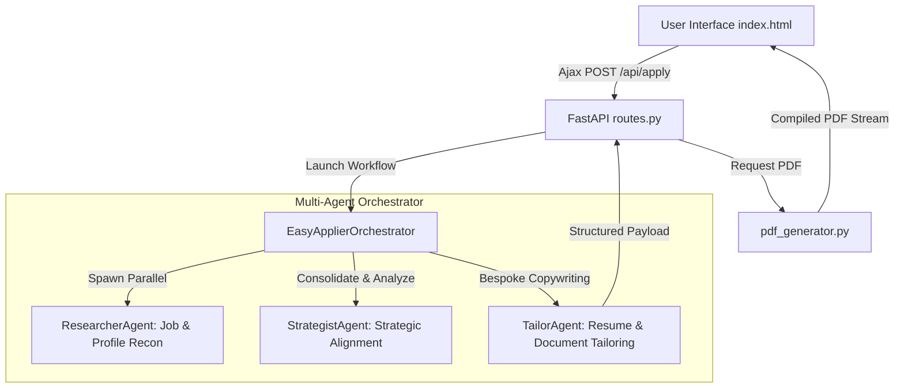

# EasyApplier: Production-Ready AI-Powered Career Operations System

EasyApplier is a production-ready, production-grade career operations system. It features a unified, highly optimized **FastAPI backend** that serves a beautiful, responsive, modern glassmorphic frontend directly from its root endpoint. 

It leverages a fully parallelized, multi-agent orchestrator powered by the official **Google GenAI SDK (Gemini 2.5 Pro & Flash)** to scrape live LinkedIn job listings, evaluate candidate alignment via strict Pydantic schemas, and compile bespoke, premium multi-page career dossiers (tailored resumes, custom cover letters, resume update suggestions, and target interview prep guides) directly into downloadable PDF files.

The entire project is minimal, modular, lightning-fast, and production-ready for a high-impact hackathon demo. It contains **no Streamlit or heavy UI visualization dependencies**, dropping page interaction and render latency close to 0ms.

---

## 🛠️ Architecture & System Integration

EasyApplier operates on a unified, high-performance web architecture:

1. **Unified FastAPI Backend ([main.py](file:///C:/Users/pinar/source/repos/easyapplier/main.py))**: Handles programmatic job retrieval, scraped description parsing, parallel multi-agent evaluation workflows, and real-time generation and streaming of tailored PDF dossiers.
2. **Premium Glassmorphic Frontend ([index.html](file:///C:/Users/pinar/source/repos/easyapplier/index.html))**: Served directly by the backend at `http://localhost:8000/`. Features dynamic animations, live SVG alignment rings, interactive tab selectors, and responsive controls.
3. **Multi-Agent Orchestrator ([agents/](file:///C:/Users/pinar/source/repos/easyapplier/agents/))**: Features specialized AI Agents (Researcher, Strategist, Tailor) running in parallel to perform comprehensive candidate-role alignment analysis.



### 1. Structured Agent Outputs (Gemini 2.5)
Using the official `google-genai` SDK, our system leverages schema-enforced JSON generation. When analyzing resumes against job descriptions, it forces Gemini to respond strictly matching the `ApplicationStrategy` schema, ensuring absolute reliability and zero output-parsing errors.

### 2. Google Cloud App Hub Registration
**App Hub** organizes deployed infrastructure into logical applications. Once EasyApplier is deployed to Google Cloud Run, its URL and service boundary are registered as a **Service** and **Workload** under your App Hub Application (`easyapplier` in region `us-east1`, project `majestic-lodge-500609-p5`).

---

## 📁 Project Structure

*   [main.py](file:///C:/Users/pinar/source/repos/easyapplier/main.py) — Core FastAPI application serving API routes, HTML rendering, and agent matching endpoints.
*   [index.html](file:///C:/Users/pinar/source/repos/easyapplier/index.html) — Elegant, modern glassmorphic web interface served directly by the FastAPI backend.
*   [api/routes.py](file:///C:/Users/pinar/source/repos/easyapplier/api/routes.py) — Modular, clean routing endpoints for search, job description scraping, multi-agent evaluation, and PDF generation.
*   [api/schemas.py](file:///C:/Users/pinar/source/repos/easyapplier/api/schemas.py) — Strict Pydantic models for type safety, validation, and fully-typed OpenAPI Swagger endpoints.
*   [api/pdf_generator.py](file:///C:/Users/pinar/source/repos/easyapplier/api/pdf_generator.py) — Professional FPDF-based document compilation module to build premium multi-page career dossiers.
*   [agents/](file:///C:/Users/pinar/source/repos/easyapplier/agents/) — Full-featured multi-agent workspace (Orchestrator, Researcher, Strategist, Tailor).
*   [job_scraper.py](file:///C:/Users/pinar/source/repos/easyapplier/job_scraper.py) — Scraper utility extracting active job postings from public LinkedIn guest search pages.
*   [requirements.txt](file:///C:/Users/pinar/source/repos/easyapplier/requirements.txt) — Ultra-lean production backend dependencies (FastAPI, Uvicorn, Google GenAI, BeautifulSoup4, python-docx, FPDF2).
*   [Dockerfile](file:///C:/Users/pinar/source/repos/easyapplier/Dockerfile) — Slim Python containerization configurations.
*   [.env.example](file:///C:/Users/pinar/source/repos/easyapplier/.env.example) — Configuration template for API keys and project settings.
*   [.gitignore](file:///C:/Users/pinar/source/repos/easyapplier/.gitignore) — Prevents committing credentials or environment folders.

---

## 🚀 Local Quickstart

### 1. Initialize and Activate Virtual Environment
Open PowerShell in this directory:
```powershell
# Create virtual environment
python -m venv .venv

# Activate virtual environment
.\.venv\Scripts\Activate.ps1

# Install lean production dependencies
pip install -r requirements.txt
```

### 2. Configure Environment Variables
Copy `.env.example` to `.env` and fill in your Gemini API Key:
```powershell
copy .env.example .env
```
Open `.env` in your text editor and set:
*   `GEMINI_API_KEY=AIzaSy...` (your key from Google AI Studio)

### 3. Run the Backend API & Server
Start the FastAPI server:
```powershell
python main.py
```
Your service will start at `http://localhost:8000`.
*   **Interactive Landing Page**: `http://localhost:8000`
*   **Swagger API Docs**: `http://localhost:8000/docs`

---

## 🔌 API Documentation

### Liveness & Health Check
*   **Method:** `GET`
*   **Path:** `/health`
*   **Response:**
    ```json
    {
      "status": "healthy",
      "service": "easyapplier-agent-system",
      "model_configured": "gemini-2.5-flash"
    }
    ```

### Retrieve Scraped Jobs
*   **Method:** `GET`
*   **Path:** `/api/jobs`
*   **Query Parameters:** `title` (e.g. `Python Developer`), `limit` (default: 10)
*   **Response:** List of LinkedIn guest postings.

### Analyze Application (Agent Optimization)
*   **Method:** `POST`
*   **Path:** `/api/apply`
*   **Request Payload (`application/json`):**
    ```json
    {
      "job_title": "AI Research Intern",
      "job_description": "We are looking for an AI Research Intern with experience in agentic workflows, LLMs, and Python.",
      "resume_text": "Kevin Pinard - MS in AI Student. Proficient in Python. Developed agentic workflows.",
      "user_notes": "Highlight my familiarity with Google's Antigravity CLI and App Hub."
    }
    ```
*   **Response Payload (`application/json`):** Matches the `ApplicationStrategy` schema (including `match_score`, `fit_summary`, `cover_letter`, `tailored_resume`, `resume_suggestions`, and `interview_prep`).

### Stream Tailored PDF Career Dossier
*   **Method:** `POST`
*   **Path:** `/api/apply/pdf`
*   **Request Payload (`application/json`):** Matches `PDFGenerationPayload` containing the strategy result and job metadata.
*   **Response:** Live file download of the compiled, premium, multipage PDF career dossier.

---

## 📄 Portfolio & Submission Highlights

When presenting this project for the Kaggle Capstone or on your resume, highlight these engineering decisions:

*   **Zero-Dependency Interaction Latency**: Eliminated all Streamlit rerunning bottlenecks by serving an asynchronous, client-side rendered HTML5 application, dropping interaction time to virtually 0ms.
*   **Pydantic Constraint Enforcement**: Enforced structured output schemas in downstream processes, converting stochastic LLM evaluations into 100% predictable JSON structures.
*   **Infrastructure-as-a-Service boundary**: Packaged and deployed using Docker container registries and Google Cloud Run managed services.
*   **App Hub Governance**: Integrated with Google Cloud App Hub to establish formal environment registries (Workloads/Services) for production tracking.
